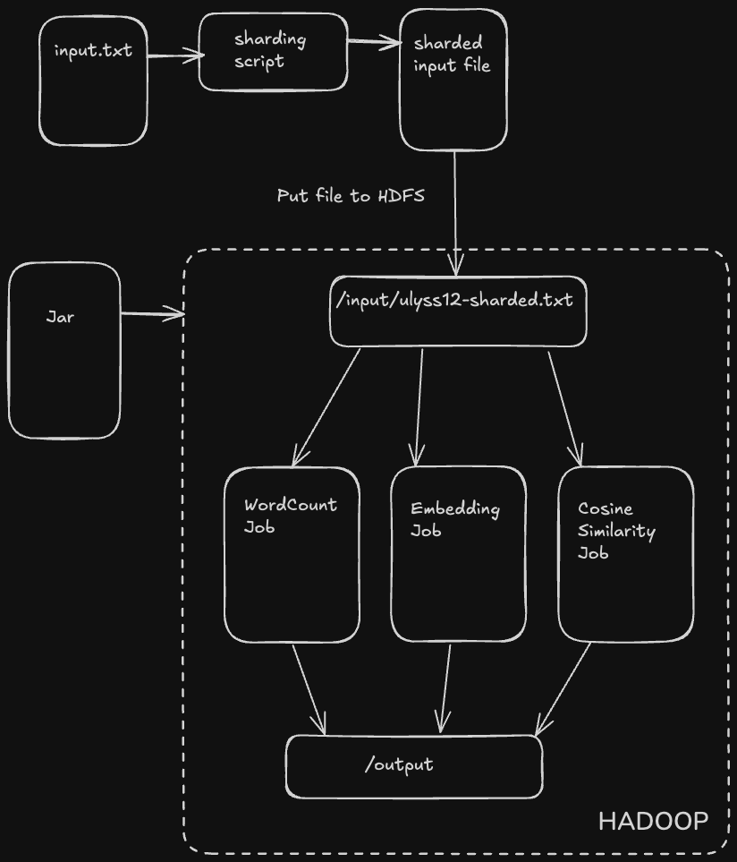
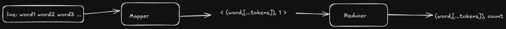
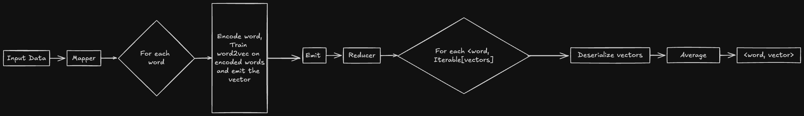

# Distributed Word Embedding and Similarity Calculation

Author - Gautham Satyanarayana  
Email - gsaty@uic.edu  
UIN - 659368048

## Introudction
As part of UIC-CS441 Engineering Distributed Objects for Cloud Computing, this project demonstrates how to train an LLM. For the first Homework, we build a mapreduce model to tokenize, encode, and finally compute word embeddings and find similar words based on these embeddings. The implementation follows a cluster run on AWS EMR where a Word2Vec model is trained independently on each mapper and the embeddings are averaged in the reducer for each token.
   <b>Video Link</b> : 
## Strategies & Frameworks
- Dataset - Books from Project Gutenberg 
- Preprocessing Strategy - Remove punctuation, numbers and force to lowercase 
- Sharding Strategy - Shard the file into n lines where each line contains 100,000 words
- Tokenization Strategy - Split each line into words
- Encoding and Training - JTokkit and Deeplearning4j
- Testing Framework - Mockito
- Config - TypeSafe Config
- Logging - Sl4j

## Environment
- MacOSX ARM64
- IntelliJ IDEA 2024.2.1
- Hadoop 3.3.6
- Scala v2.13.12
- SBT v1.10.2

## Data Flow and Logic
### Hadoop / EMR Flow

### Data Structures and Flow
1. WordCount Job
   1. Mapper
      1. Clean the sentence by removing punctuation and numbers and trailing white spaces and forcing to lowercase
      2. Split the sentence by spaces and for each token - map the word, its byte pair encoding and 1 - `<Text, IntWritable>` as `<(word, encoding), 1>`
   2. Reducer
      1. For `<key: Text, values: Iterable[IntWritable]>` sum all the values
      2. Format a resulting writable Text as `s"$word, $encodingStr, $sum"`
      3. Output this resulting string; example - `hello,96,54`

2. Embedding Job
   1. Mapper
      1. On the sharded data mapped as `<key, line>`, clean the line as mentioned in the previous step, and tokenise the words to their byte pair encodings
      2. I followed a format to map the encoding IntArray to a string by concatenating these integers in the encoding array into a string separated by `:`, 
       Example - `"melodiously" -> [20, 187, 923] -> "20:187:923"`
        `"hello world" -> [[96], [182,34]] -> "96 182:34"`
      3. Now a Word2Vec model is trained using Deeplearning4j on this tokenised and encoded sentence
      4. For every word in this local mapper's model, we emit the word and its embedding in the format `<word: Text, vector: Text(v1,v2,v3,...,vn)>`  
      where n is the dimension of the vector and the word is decoded from the token using helper functions to decode a token `1:2:3` into `IntArrayList [1, 2, 3]`
   2. Reducer
      1. For every pair of key and values - word and array of vectors `<word: Text, vectors: Iterable[String]>`, Deserialize them into `Array[Double]`
      2. Sum up these vectors on each dimension and divide each dimension by the number of dimensions chosen
      3. Output this averaged vector as the resulting word embedding for this word as `<word: Text, avgVector: Text(v1, v2, ... , vn)>`

3. Cosine Similarity Job
   1. Mapper
      2. The input line comes from the sharded embeddings file where each line contains 5000 vectors
      3. For every pair of vectors in this list, compute the cosine similarity and if it is greater than a set threshold, emit this pair along with the similarity as `word1, (word2, similarity)`
   4. Reducer
      5. For every `wordI, Iterable[(wordJ, simIJ)]` sort the Iterable and emit the top 5 wordJ for wordI with highest similarity scores

## Test Suite

## Results
1. WordCount Results are found in `/src/main/resources/wordcount.txt` (Vocabulary Size result in last line of file, emitted by reducer)
2. Embedding Results are found in `/src/main/resources/embeddings.txt`
3. Cosine Results are found in `/src/main/resources/similarity.txt`

## Usage
1. Clone this repository
2. `cd` into the root of the project repository
3. `sbt update` - Installs the dependencies in build.sbt
4. `sbt assembly` - The jar file should be created in the `/target/scala-2.13` directory
5. `hdfs dfs -put ./src/main/resources/*.txt /input` - upload all the input files to hdfs
6. `hadoop jar ./target/scala-2.13/hw1.jar stat /input/ulyss12-sharded.txt /output-stat` - Runs the map reduce job for generating vocabulary and word count on hadoop locally.
7. `hadoop jar <name of jar file> stat /input/ulyss12-sharded.txt /output-wc` - Runs the map reduce job for computing word count and vocabulary on hadoop locally.
8. `hadoop jar <name of jar file> embedding /input/ulyss12-sharded.txt /output-embedding` - Runs the map reduce job for computing word embeddings on hadoop locally.
9. `hadoop jar <name of jar file> cosSim /input/ulyss12-sharded.txt /output-cosSim` - Runs the map reduce job for finding similar words for each word in the vocabulary on hadoop locally.