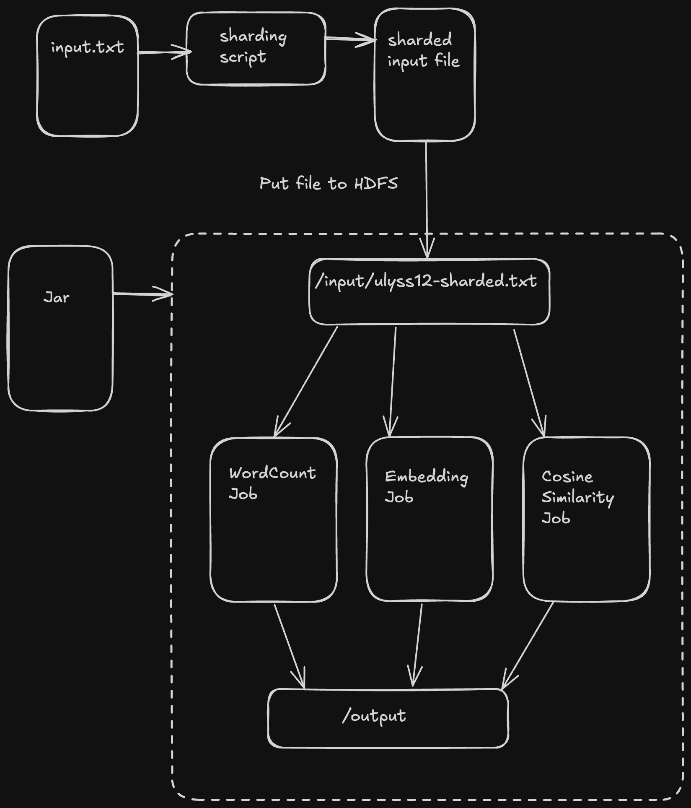

# Distributed Word Embedding and Similarity Calculation

Author - Gautham Satyanarayana  
Email - gsaty@uic.edu

### Environment
- MacOSX arm64
- IntelliJ IDEA 2024.2.1
- Hadoop 3.3.6

### Data Flow and Logic

### Usage
1. Clone this repository
2. `cd` into the root of the project repository
3. `sbt update` - Installs the dependencies in build.sbt
4. `sbt assembly` - The jar file should be created in the /target directory
5. `hdfs dfs -put ./src/main/resources/ulyss12-sharded.txt /input/ulyss12-sharded.txt` - upload the sharded input file to hdfs
6. `hadoop jar ./target/scala-2.13/hw1-assembly-0.1.0-SNAPSHOT.jar stat /input/ulyss12-sharded.txt /output-stat` - Runs the map reduce job for generating vocabulary and word count on hadoop locally.
7. `hadoop jar <name of jar file> embedding /input/ulyss12-sharded.txt /output-embedding` - Runs the map reduce job for computing word embedding on hadoop locally.